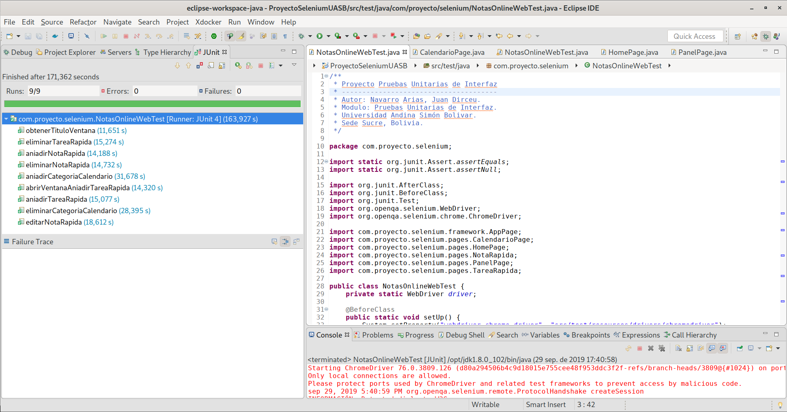
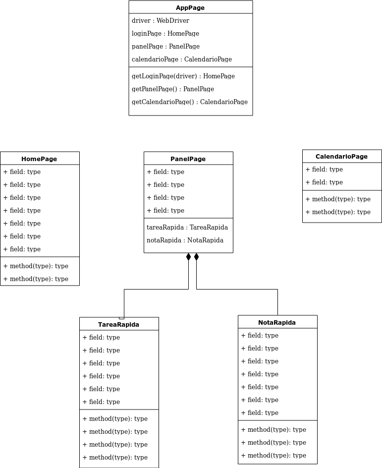

# Proyecto Pruebas Unitarias de Interfaz

Autor: Navarro Arias, Juan Dirceu.  
Modulo: Pruebas Unitarias de Interfaz.  
Universidad Andina Simón Bolivar.  
Sede Sucre, Bolivia.

## Descripción.

Pruebas realizadas a la página: [https://www.notasonline.es/](https://www.notasonline.es/)  

Pruebas realizadas:  

- obtenerTituloVentana  
- abrirVentanaAniadirTareaRapida  
- aniadirTareaRapida  
- eliminarTareaRapida  
- aniadirCategoriaCalendario  
- eliminarCategoriaCalendario  
- aniadirNotaRapida  
- eliminarNotaRapida  
- editarNotaRapida  

Pruebas realizadas en Eclipse que pasaron de forma exitosa:  
  
  

## Herramientas utilizadas.

Para la realización del proyecto se utilizaron las siguientes herramientas:

- Sistema operativo: Debian 10 con Gnome  
- IDE de desarrollo: Eclipse v4.12.0  
- Navegador web: Chromium v76.0.3809.100 (Developer Build)  
- Lenguaje de desarrollo: Java v1.8.0_102  
- Framework de automatización: Selenium Webrive v3.141.59  
- Framwork de pruebas unitarias: JUnit v4.13-beta-1  
- ChromeDriver: Linux 64 v76.0.3809.126 ([descarga](https://chromedriver.storage.googleapis.com/760.3809.126/chromedriver_linux64.zip))

## Preparación para la ejecución de las pruebas.
Importar el proyecto (archivo zip) con Eclipse de la siguiente forma:  

- Ir al Menu "File" y seleccionar "Import..."  
- Elegir General y luego "Projects from Folder or Archive"
- En la ventana elegir en "Import Source" en botón "Archive..." para seleccionar el archivo .zip.
- En folder desmarcar el folder que tiene el nombre con la palabra "expanded".
- Presionar el botón "Finish".

El proyecto viene incorporado con el driver para Chromium de Linux, se encuentra en el directorio: `src/test/resources/drivers`   
Posiblemente cuando se quiera hacer correr el proyecto, se tenga que dar permisos de ejecución al driver, se deberá entrar al directorio donde se encuentra almacenado el driver y luego dar el permiso de ejecución:

- chmod +x geckodriver

## Ejecución de las pruebas.
**Nota a tomar en cuenta:** La velocidad de la conexión puede afectar el funcionamiento de las pruebas, si alguna prueba falla, se debe hacer la prueba nuevamente.  

Una vez importado el proyecto, se se puede ejecutar las pruebas individuales o en grupo.
Para ejecutar las pruebas en grupo, se puede hacer click derecho en el nombre del proyecto y luego seleccionar la opción "Run As" y luego la opción "JUnit Test" o desde el archivo de las pruebas com.proyecto.selenium.NotasOnlineWebTest y hacer click derecho en el nombre de la clase y luego seleccionar la opción "Run As" y luego la opción "JUnit Test".   

También se puede ejecuar una prueba específica individual haciendo click derecho en la prueba específica del archivo com.proyecto.selenium.NotasOnlineWebTest y luego seleccionar la opción "Run As" y luego la opción "JUnit Test".   

## Diagrama Page Object 

El diagrama se realizó con [https://www.draw.io/](https://www.draw.io/)  

